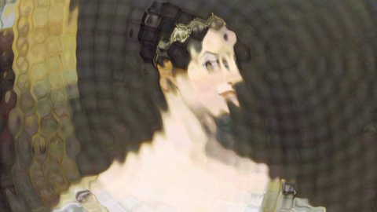
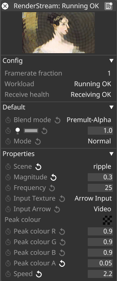

## RenderStream-ShaderToy

RenderStream-ShaderToy allows you to load GLSL fragment shaders and present them as selectable RenderStream scenes. Shader uniforms are exposed as controllable RenderStream parameters, enabling dynamic customization.

 
*The ripple demo shader running on the `ada.jpg` sample image*

## Installation

1. Install [RenderStream-Python](https://github.com/disguise-one/renderStream-py).
2. Copy this repository into a folder within your RenderStream Projects directory.
3. In Designer, configure a RenderStream layer to use the ShaderToy asset.

 
*The ripple demo running in a RenderStream Layer inside Designer*

## Creating Custom Shaders

The included demo shaders are for reference. To fully utilize RenderStream-ShaderToy, you can create custom shaders.

### Adding Shaders

Place your custom shaders in the `shaders` folder within the RenderStream-ShaderToy asset directory. All `.glsl` files in this folder are parsed and added as selectable scenes in the RenderStream asset, visible in the Designer Layer.

While a RenderStream layer is running, you can edit shader files directly. Updates to the files are automatically reloaded, dynamically updating parameters and visual effects. Note: This workflow is less effective in clustered environments but is ideal for shader development.

### Shader Uniforms

Uniforms are shader properties that remain constant over a single frame. These are exposed as controllable parameters in the RenderStream Layer. You can [extend uniforms with attributes](./doc/uniforms.md) to customize how they are exposed.

### Shader Passes

Complex shaders may require multiple generative inputs. For example, a terrain scene might generate a height map in a separate pass and sample it instead of computing it for every ray cast.

- Add passes to the `shaders/passes` folder.
- All `.glsl` files in this folder are accessible to scene shaders in the `shaders` folder using the [pass attribute](./doc/uniforms.md#pass).

You can also use the [previous attribute](./doc/uniforms.md#previous) to access a previous frame's image data, useful for effects like motion trails.

### Using Images

Some shaders require predefined images, such as noise textures. The repository includes sample noise images for texturing effects. You can add additional images to the `images/` folder as needed.